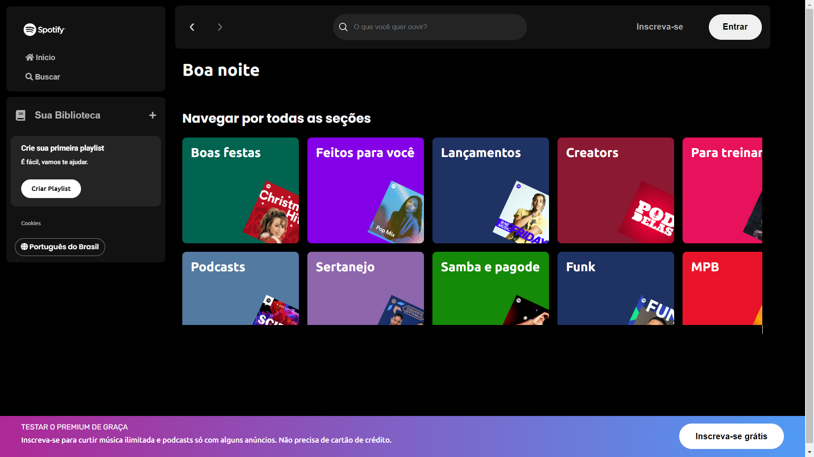
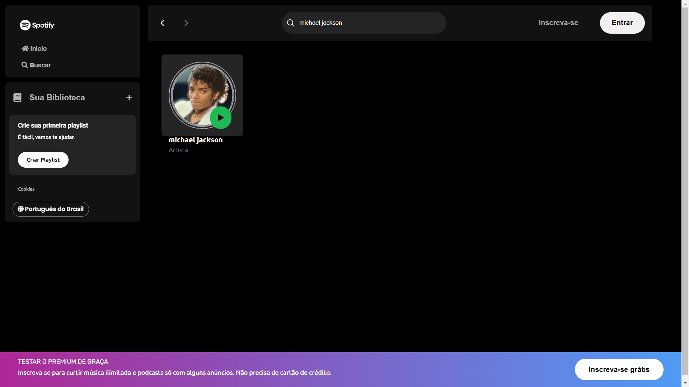
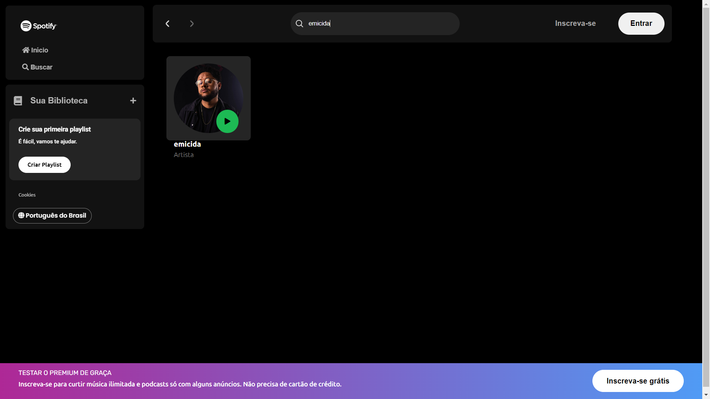

# 👋 welcome to my spotify clone

Hello how are you? My name is Miguel, I've been a FullStack developer for over 4 years, I've been programming since I was 11 years old (I'm currently 15 years old), I'm passionate about this area, and today I'm going to show you the clone of the Spotify main page.
Well, I need to add some functions, I intend to add a database for users to register and/or log into their accounts.
That's it, I hope you liked!

## 📚 About the project

The Spotify clone project has some interesting functions, such as searching for artists, browsing the musical styles sections, etc.
As I said, I intend to add a database so that the site has an account registration function.

#

#

To access the website [click here](https://devmgdp.github.io/spotify-clone/)

## 💻 Used Programming Languages

  
  
  
  
  

